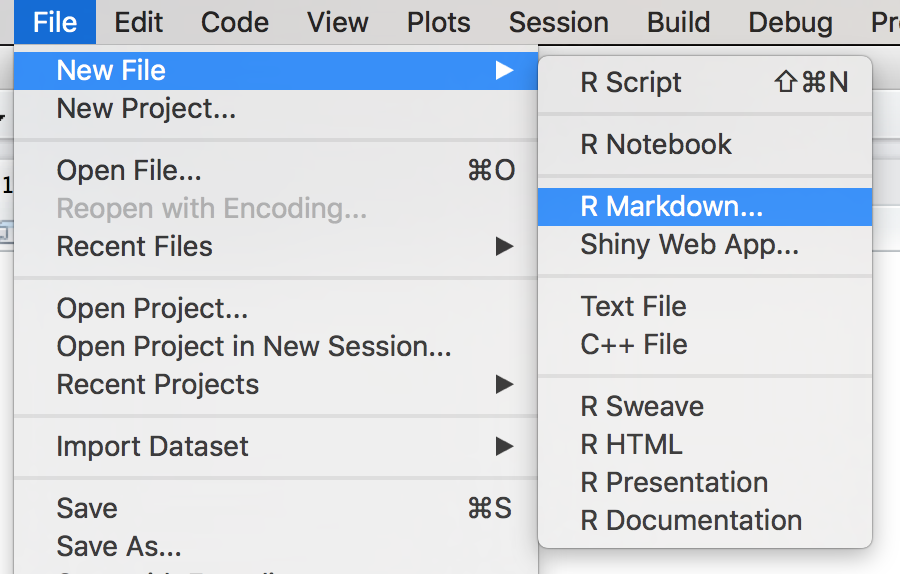
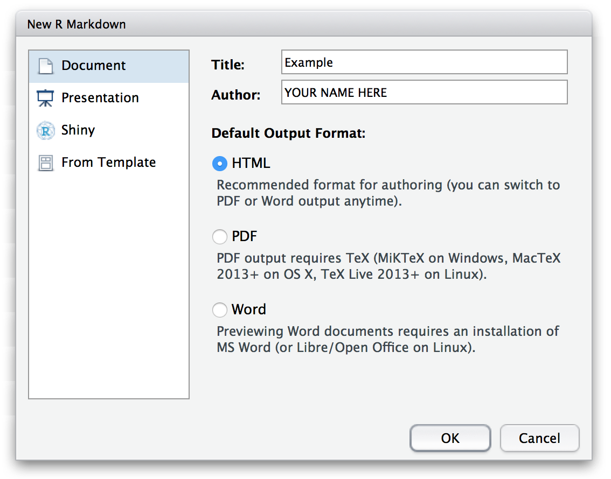

# Module 12: R Markdown

R Markdown is a package that supports using `R` to dynamically creating _documents_, such as websites (`.html` files), reports (`.pdf` files), slideshows (using `ioslides/slidy`), and even interactive apps (using `shiney`).
As you may have guessed, R Markdown does this by providing the ability to blend Markdown syntax and `R` code so that, when executed, scripts will automatically injec your results into a formatted document. The ability to automatically generate reports and documents from a computer script eliminates the need to manually update the _results_ of a data analysis project, enabling you to more effectively share the _information_ that you've produced from your data.

<!-- START doctoc generated TOC please keep comment here to allow auto update -->
<!-- DON'T EDIT THIS SECTION, INSTEAD RE-RUN doctoc TO UPDATE -->
**Contents**

- [Resources](#resources)
- [R Markdown and RStudio](#r-markdown-and-rstudio)
  - [Creating `.Rmd` Files](#creating-rmd-files)
  - [`.Rmd` Content](#rmd-content)
  - [Knitting Documents](#knitting-documents)
  - [HTML?](#html)
- [R Markdown Syntax](#r-markdown-syntax)
  - [Code Blocks](#code-blocks)
  - [Inline Code](#inline-code)

<!-- END doctoc generated TOC please keep comment here to allow auto update -->

## Resources
- [R Markdown Homepage](http://rmarkdown.rstudio.com/)
- [R Markdown Cheatsheet](https://www.rstudio.com/wp-content/uploads/2016/03/rmarkdown-cheatsheet-2.0.pdf) (really useful!)
- [R Markdown Reference](https://www.rstudio.com/wp-content/uploads/2015/03/rmarkdown-reference.pdf) (really useful!)
- [`knitr`](https://yihui.name/knitr/)

## R Markdown and RStudio
R Markdown documents are created from a combination of two libraries: `rmarkdown` (which process the markdown and generates the output) and `knitr` (which runs R code and produces markdown like output). These packages are already included in RStudio, which provides built-in support for creating and viewing R Markdown documents.

### Creating `.Rmd` Files
The easiest way to begin a new document is to use the **File > New File > R Markdown** menu option:



RStudio will then prompt you to provide some additional details abour what kind of R Markdown document you want. In particular, you will need to choose a default _document type_ and _output format_. You can also provide a title and author information which will be included in the document. In this module we'll focus on creating HTML documents (websites; the default format)&mdash;other formats require the installation of additional software.



Once you've chosen _R Markdown_ as your desired file type, you'll be prompted to choose a default _document type_ and _output format_ that you would like to create. In this module, we'll discuss creating `.html` documents (websites):


Once you've chosen your desired document type and output format, RStudio will open up a new script file for you. The file contains some example code for you.

### `.Rmd` Content
At the top of the file is some text that has the format:

```yaml
---
title: "Example"
author: "YOUR NAME HERE"
date: "1/30/2017"
output: html_document
---
```

This is the document "header" information, which tells R Markdown details about the file and how the file should be processed. For example, the `title`, `author`, and `date` will automatically be added to the top of your document. You can include additional information as well, such as [whether there should be a table of contents](http://rmarkdown.rstudio.com/html_document_format.html) or even [variable default](http://rmarkdown.rstudio.com/developer_parameterized_reports.html).

The header is written in [YAML](https://en.wikipedia.org/wiki/YAML) format, which is yet another way of formatting structured data similar to `.csv` or JSON (in fact, YAML is a superset of JSON and can represent the same data structure, just using indentation and dashes instead of braces and commas).

After this header you will find two types of contents: normal Markdown text like you learned in Module 3 (e.g., `## R Markdown` for a second-level heading), and blocks of `R` code. The `R` code looks like a normal code block element (using ` ``` `), but with an extra `{r}` immediately after the backticks. See below for more details about this format.

**Important** This file should be saved with the extension **`.Rmd`** (for "R Markdown"), which tells the computer and RStudio that the document contains Markdown content with embedded `R` code.

### Knitting Documents
RStdudio provides an easy interface to compile your `.Rmd` source code into an actual document (a process called "knitting"). Simply click the **Knit** button at the top of the script panel:


This will generate the document (in the same directory as your `.Rmd` file), as well as open up a preview window in RStudio.

While it is easy to generate such documents, the knitting process can make it hard to debug errors in your `R` code (whether syntax or logical), in part because the output may or may not show up in the document! I suggest that you write complex `R` code in another script and then simply copy or `source()` that script into your `.Rmd` file. Additionally, be sure and knit your document frequently, paying close atention to any errors that appear in the console.

### HTML?
Assuming that you've chosen HTML as your desired output type, RStudio will compile your `.Rmd` into an `.html` file. HTML stands for _**H**yper**T**ext **M**arkup **L**anguage_ and like Markdown is a syntax for describing the structure and formatting of content (mostly the structure!), though HTML is **far** more extensive and detailed. In particular, HTML is a is a markup language that can be rendered by web browsers, and thus is the language used to create web pages. Thus the `.html` files you create could be put online as web pages for others to view&mdash;we will learn how to do this in a future module. For now, you can open a `.html` file in any browser (such as by double-clicking on the file) to see the content outside of RStudio!


## R Markdown Syntax
What makes R Markdown distinct from simple Markdown code is the ability to actually _execute your `R` code and include the output directly in the document_. `R` code can be executed and included in the document in blocks of code, or even inline in the document!

### Code Blocks
To specify an executed code block (rather than text that is simply formatted as code), you need to include **`{r}`** immediately after the backticks that start the code block (the ` ``` `). For example

```md
Write normal *markdown* out here, then create a code block:

```{r}
# Execute r code in here
x <- 1
``` # end the code block

Back to writing _markdown_ out here.
```

It is also possible to do additional configuration option by including a comma-separate list of named arguments (like we've done with lists and functions) inside the curly braces following the `r`:

```r
```{r echo=FALSE, message=TRUE}
# ...
``` # end code block
```

There are [many options](https://yihui.name/knitr/options/) (see also the [reference](https://www.rstudio.com/wp-content/uploads/2015/03/rmarkdown-reference.pdf)). However the most useful ones have to do with how the code is outputted in the the document. For example

- **`echo`** indicates whether you want the _`R` code itself_ to be displayed in the document (e.g., if you want readers to be able to see your work and reproduce your calculations and analysis). Value is either `TRUE` (do display) or `FALSE` (do not display).
- **`message`** indicates whether you want any messages generated by the code to be displayed. This includes print statements! Value is either `TRUE` (do display) or `FALSE` (do not display).

### Inline Code
In addition to creating distinct code blocks, you may want to execute `R` code _inline_ with the rest of your text, such as to include a variable result inside a paragraph of text. As with code blocks, you'll follow the Markdown convention of using single backticks (**`` ` ``**), but put the letter **`r`** imediately after the first backtick. For example:

```
If we want to calculate 3 + 4 inside some text, we can use `r 3 + 4` right in the _middle_.
```

When you compile the above text, the `` `r 3+4` `` When you compile the section above, the `r 3 + 4` would be replaced with the number `7`. Note you can also reference values computed in the code blocks preceding your inline code; it is code practice to do your calculations in a code block (with `echo=FALSE`), save the result in a variable, and then simply inline that variable: `` `r my.variable` ``.
